<h1 align="center">
  
</h1>

Hey ! My name is Pierre and i'm an ingineering student

---

<table>
   <tr>
   <td colspan="9" align="center">
        💼 IDE Tools
    </td>
  </tr>
  <tr>
    <td align="center" width="96">
        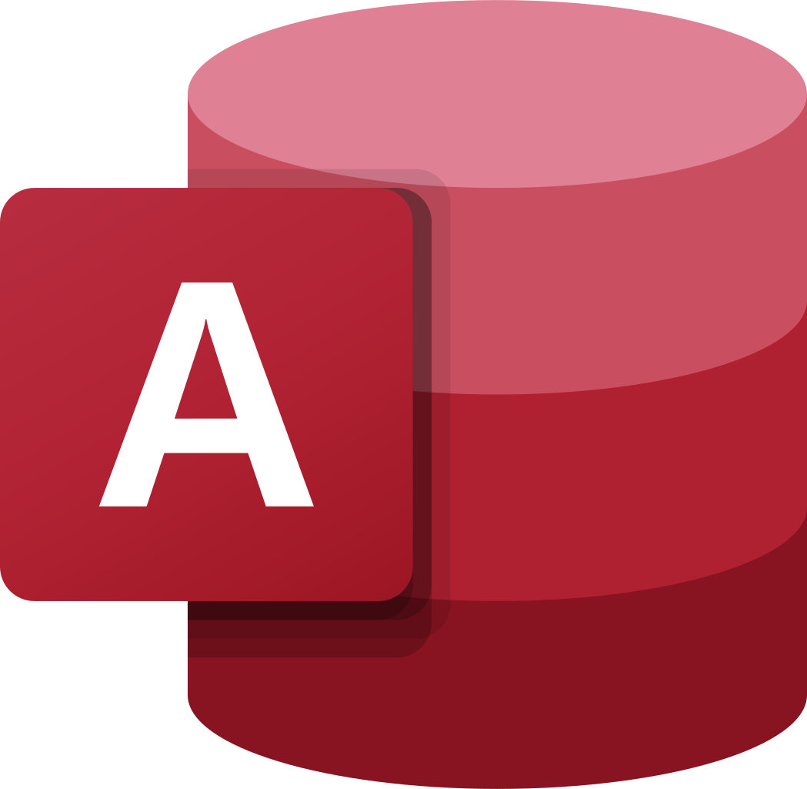
       Access
    </td>
    <td align="center" width="96">
        
       Android
    </td>
    <td align="center" width="96">
        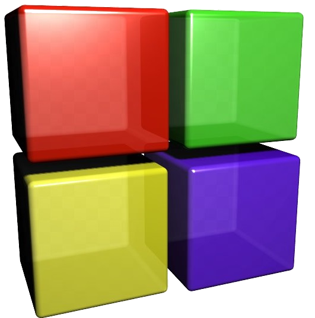 
       Code::Blocks
    </td>
    <td align="center" width="96">   
            
       Eclipse
    </td> 
    <td align="center" width="96">     
        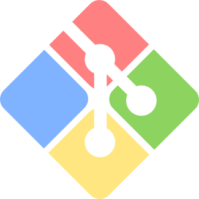      
       GitBash
    </td>
    <td align="center" width="96">    
             
       GitLab
    </td>
    <td align="center" width="96">    
              
       Jupyter
    </td>
    <td align="center" width="96">     
            
       Mysql
    </td>
    <td align="center" width="96">    
           
       NodeJs
    </td>
  </tr>
  <tr>
    <td align="center" width="96">     
           
       Qt Creator
    </td>
    <td align="center" width="96">    
            
       R Studio
    </td>
    <td align="center" width="96">  
        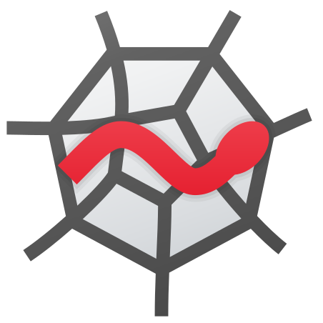  
       Spyder
    </td> 
    <td align="center" width="96">    
        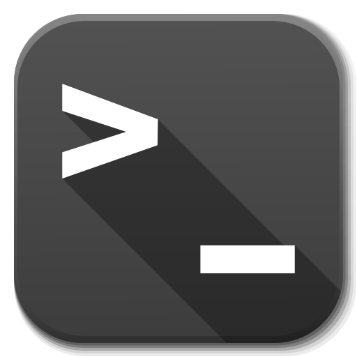     
       Terminal
    </td>
    <td align="center" width="96">   
        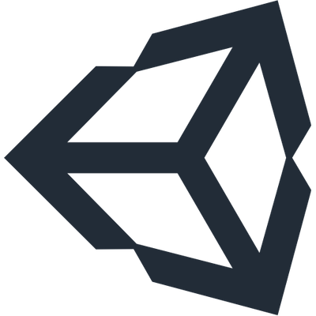    
       Unity
    </td>
    <td align="center" width="96">    
        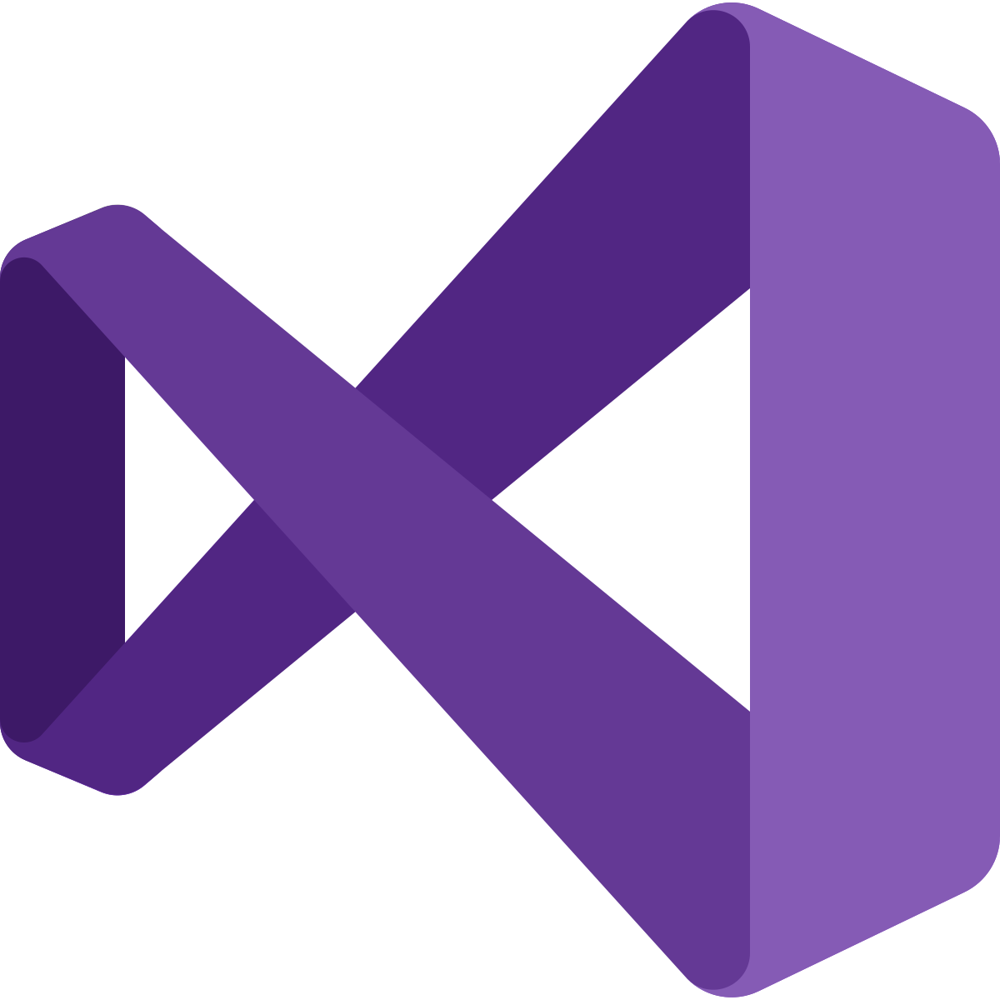   
       Studio
    </td>
    <td align="center" width="96">
          
       Code
    </td>
    <td align="center" width="96">   
           
       Xampp
    </td> 
    <td align="center" width="96"> 
        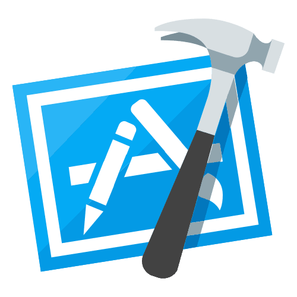 
       Xcode
    </td>
  </tr>
</table>
 
<table>
  <tr>
   <td colspan="9" align="center"> 
        🔨 Object-Oriented Programming   
    </td>
  </tr>
  <tr>
    <td align="center" width="96"> 
        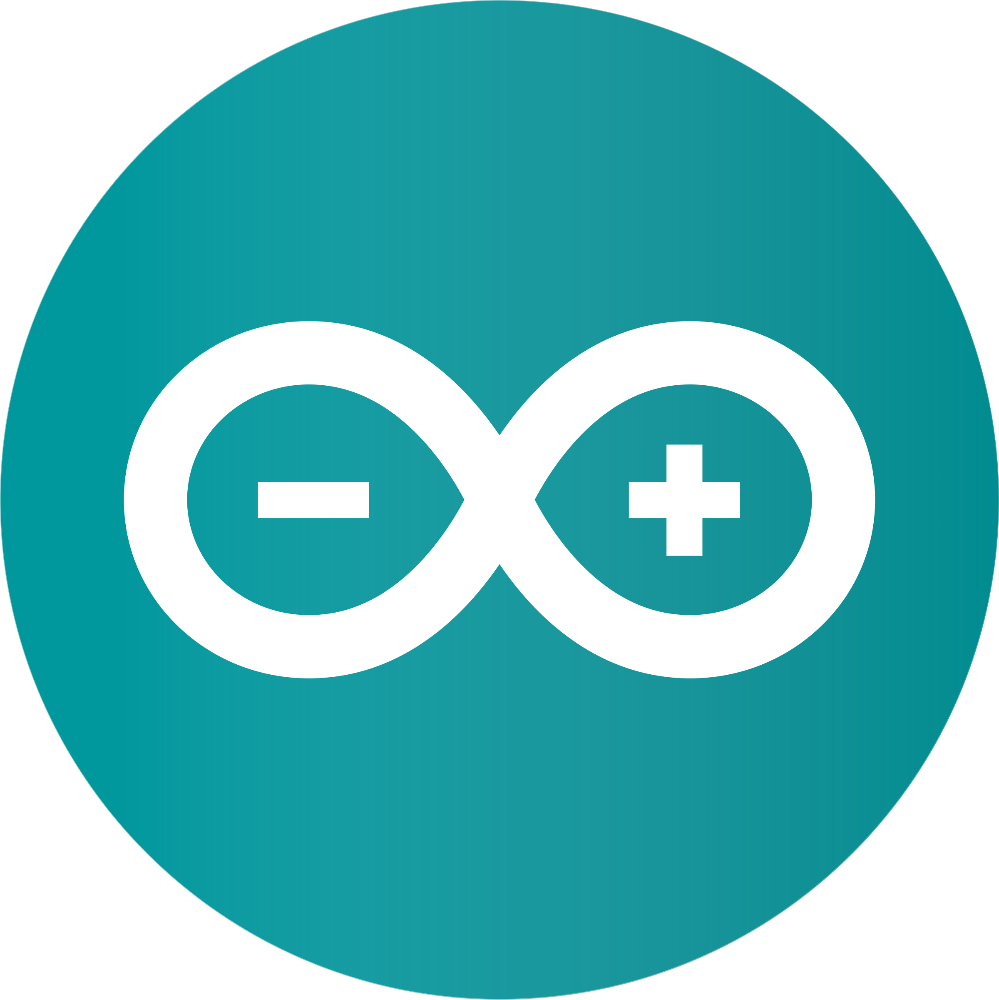
       Arduino
    </td>
    <td align="center" width="96">  
        
       C
    </td>
    <td align="center" width="96"> 
        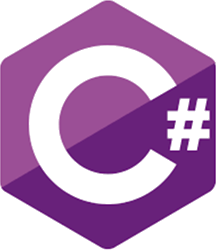
       C#
    </td>
    <td align="center" width="96">
        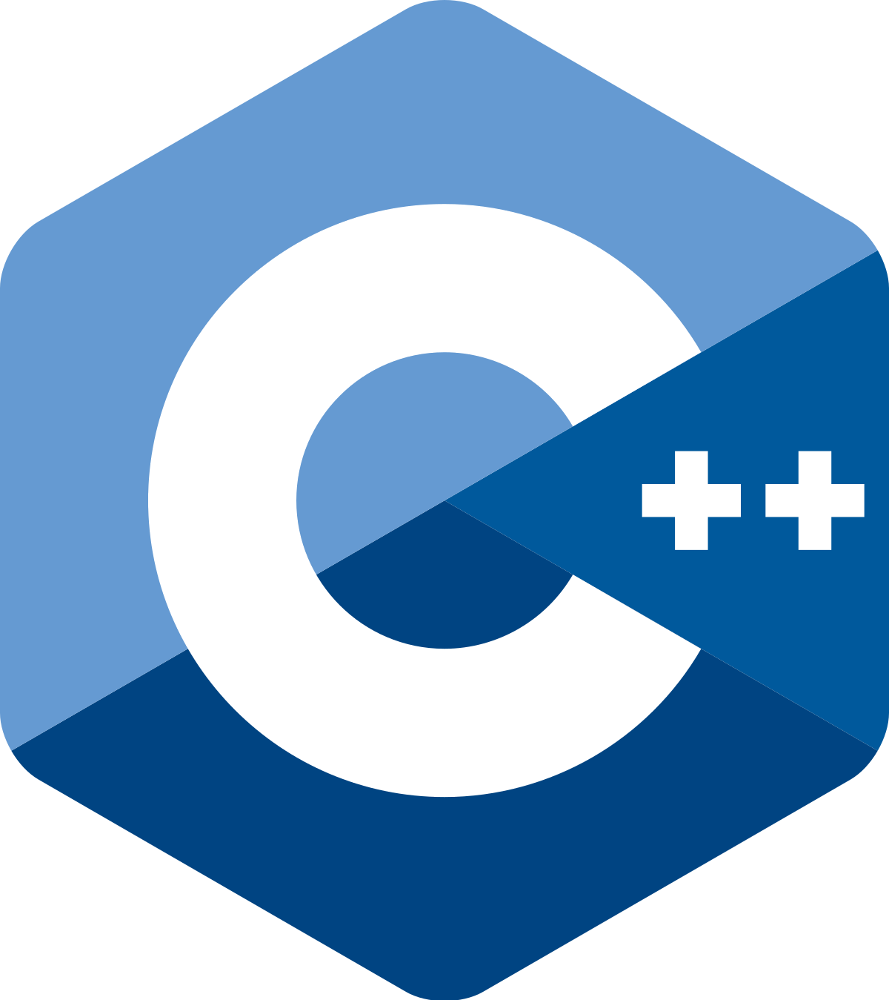
       C++
    </td>
    <td align="center" width="96">
        
       VB.net
    </td>
    <td align="center" width="96">
        
       Java
    </td>
    <td align="center" width="96">
        
       Python
    </td>
    <td align="center" width="96">
        
       Qt Creator
    </td>
    <td align="center" width="96">
        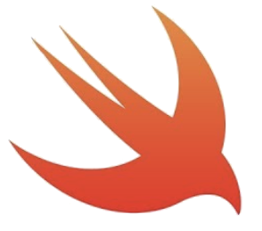
       Swift
    </td>
  </tr>
</table>
 
<table>
   <tr>
   <td colspan="5" align="center">
        ✏️ Web Programming
    </td>
    <td colspan="4" align="center">
       🌱 OS
    </td>
  </tr>
  <tr>
    <td align="center" width="96">
        
       HTML5
    </td>
    <td align="center" width="96">
        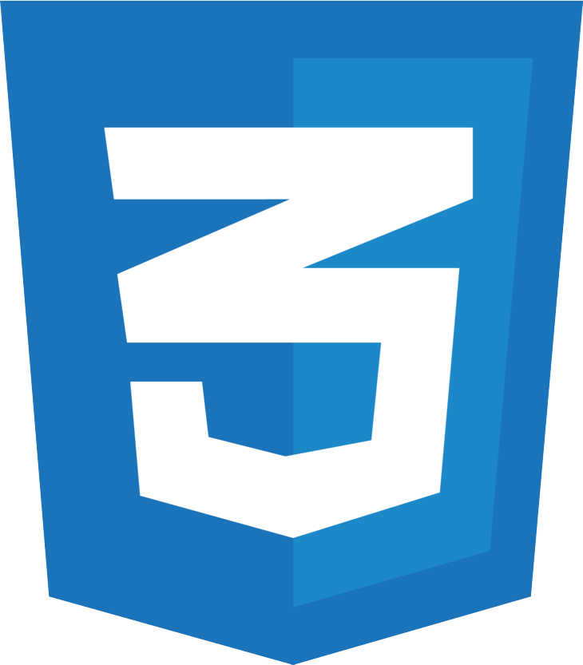
       CSS3
    </td>
    <td align="center" width="96">
        
       SQL
    </td>
    <td align="center" width="96">
        
       PHP
    </td> 
    <td align="center" width="96"> 
        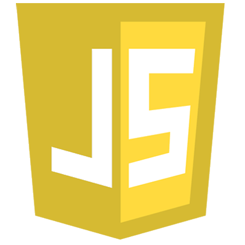
       JavaScript
    </td>
    <td align="center" width="96">
        
       Debian
    </td>
    <td align="center" width="96">
        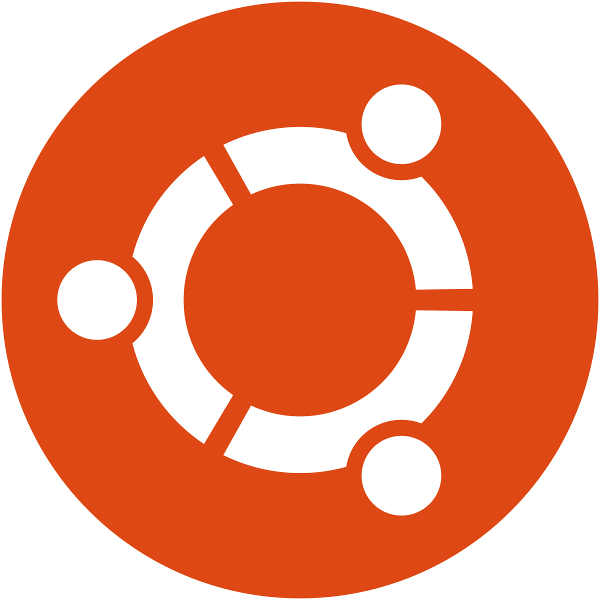
       Ubuntu
    </td>
    <td align="center" width="96">
        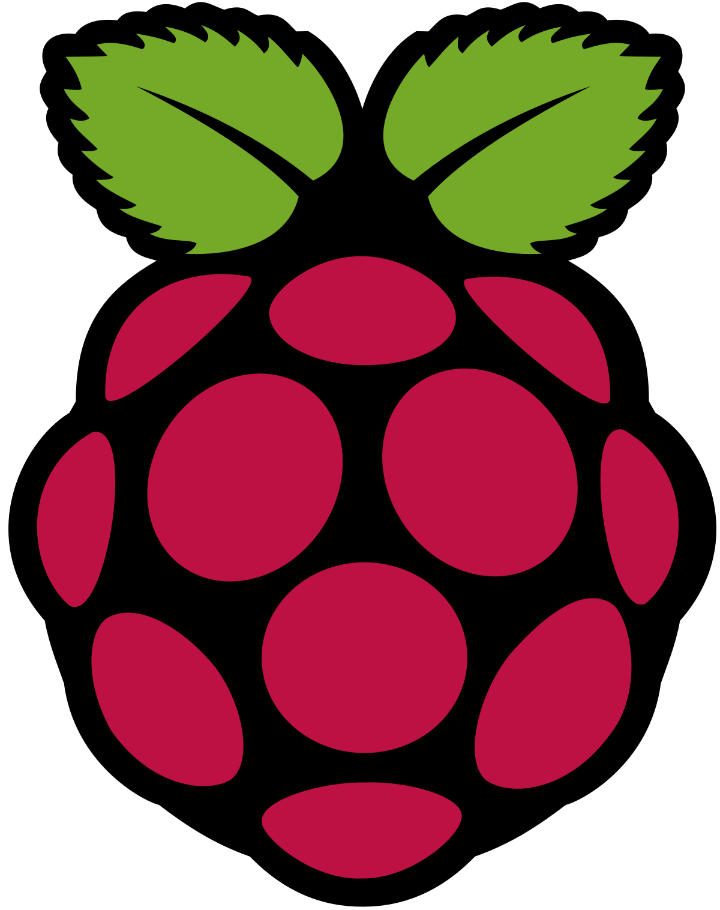
       Rasberry
    </td> 
    <td align="center" width="96">
        
       Android
    </td>
  </tr>
</table>

| 🏆 Github Stats | 🏅 Top Languages |
| --- | --- |
| |  |

 
 

<!--
<table>
  <tr>
   <td colspan="9" align="center"> 
        📃 Follow me
    </td>
  </tr>
  <tr>
    <td align="center" width="96"> 
        <a href="https://discord.gg/v98A3GENaU">
       Discord</a>
    </td>
    <td align="center" width="96">  
        <a href="https://www.snapchat.com/add/trynjitsu">
       Snapchat</a>
    </td>
    <td align="center" width="96"> 
        <a href="https://www.facebook.com/profile.php?id=100011270256643">
       Facebook</a>
    </td>
    <td align="center" width="96">
        <a href="https://www.twitch.tv/trynjutsu">
       Twitch</a>
    </td>
    <td align="center" width="96">
        <a href="https://www.linkedin.com/in/pierre-p-91447a1a1/">
       LinkedIn</a>
    </td>
    <td align="center" width="96">
        <a href="https://www.youtube.com/channel/UCrxPFOySNprkwMxjyG8IQXA/about">
       Youtube</a>
    </td>
    <td align="center" width="96">
      <a href="https://www.speedrun.com/user/Trynjitsu" >
       SpeedRun</a>
    </td>
    <td align="center" width="96">
        <a href="https://www.chess.com/member/trynjitsu">
       Chess.com</a>
    </td>
    <td align="center" width="96">
        <a href="https://www.root-me.org/Elipse?lang=fr#7cd12695e77951472fca7d325b70e505">
       Rootme</a>
    </td>
  </tr>
</table>
-->

<table>
  <tr>
   <td colspan="9" align="center"> 
        📃 Follow me
    </td>
  </tr>
  <tr>
    <td align="center" width="384">
        
    </td>

    <td align="center" width="96">
        <a href="https://www.speedrun.com/user/Trynjitsu" >
       SpeedRun</a>
    </td>

    <td align="center" width="384">
        
    </td>
  </tr>
</table>

---

 
  Visitor Count
   
   
  

<!-- [App Screenshot](https://counter9.stat.ovh/private/compteurdevisite.php?c=dzct1uqm5lpgwmqn18387dkn26w125w5) -->

