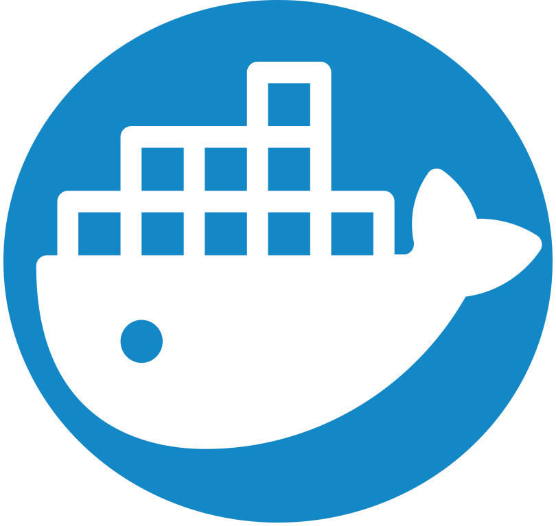

<h1 align="center">
  
</h1>

<table align="center">
   <tr>
   <td colspan="9" align="center">
        💼 IDE Tools
    </td>
  </tr>
  <tr>
    <td align="center" width="96">
        
       Android
    </td>
    <td align="center" width="96">
        
       Bash
    </td>
    <td align="center" width="96">
         
       CodeBlocks
    </td>
      <td align="center" width="96">     
              
       Django
    </td>
    <td align="center" width="96">    
             
       Docker
    </td>
    <td align="center" width="96">   
            
       Eclipse
    </td>
    <td align="center" width="96">    
             
       FileZilla
    </td>
    <td align="center" width="96">    
              
       Jupyter
    </td>
    <td align="center" width="96">   
           
       Laragon
    </td> 
  </tr>
  <tr>
    <td align="center" width="96">     
            
       MySQL
    </td>
    <td align="center" width="96">    
           
       NodeJs
    </td>
    <td align="center" width="96">     
           
       QtCreator
    </td>
    <td align="center" width="96">    
            
       R Studio
    </td>
    <td align="center" width="96">  
          
       Spyder
    </td> 
    <td align="center" width="96">   
            
       Unity
    </td>
    <td align="center" width="96">    
           
       Studio
    </td>
    <td align="center" width="96">
          
       Code
    </td>
    <td align="center" width="96"> 
         
       Xcode
    </td>
  </tr>
</table>
 
<table align="center">
  <tr>
   <td colspan="9" align="center"> 
        🔨 Programming Languages 
    </td>
  </tr>
  <tr>
    <td align="center" width="96"> 
        
       Arduino
    </td>
    <td align="center" width="96">  
        
       C
    </td>
    <td align="center" width="96"> 
        
       C#
    </td>
    <td align="center" width="96">
        
       C++
    </td>
    <td align="center" width="96">
        
       VB.net
    </td>
    <td align="center" width="96">
        
       Java
    </td>
    <td align="center" width="96">
        
       Python
    </td>
    <td align="center" width="96">
        
       Qt
    </td>
    <td align="center" width="96">
        
       Swift
    </td>
  </tr>
</table>
 
<table align="center">
   <tr>
   <td colspan="5" align="center">
        ✏️ Web Programming
    </td>
    <td colspan="4" align="center">
       🌱 OS
    </td>
  </tr>
  <tr>
    <td align="center" width="96">
        
       HTML
    </td>
    <td align="center" width="96">
        
       CSS
    </td>
    <td align="center" width="96">
        
       SQL
    </td>
    <td align="center" width="96">
        
       PHP
    </td> 
    <td align="center" width="96"> 
        
       JavaScript
    </td>
    <td align="center" width="96">
        
       Debian
    </td>
    <td align="center" width="96">
        
       Ubuntu
    </td>
    <td align="center" width="96">
        
       Rasberry
    </td> 
    <td align="center" width="96">
        
       Android
    </td>
  </tr>
</table>

---

<table align="center">
  <tr>
   <td colspan="3" align="center"> 
        🏴 Web Site Competition Challenge
   </td>
  </tr>
  <tr>
   <td align="center" width="288" height="64">
        🌺 CSS
   </td>
   <td align="center" width="288" height="64"> 
        🤖 Artificial Inteligence
   </td>
   <td align="center" width="288" height="64">
        🔑 CyberSecurity
   </td>
  </tr>
  <tr>
    <td align="center" width="288" height="64">
      
      
⭐ 600 points
 
	  </td>
	  <td align="center" width="288" height="64">
      
      
⭐ Unranked
 
    </td>
    <td align="center" width="288" height="64">
      
      
⭐ 50 points
 
    </td>
  </tr>
</table>
 
<table align="center">
  <tr>
   <td colspan="1" align="center"> 
        🏆 Github Stats
   </td>
   <td colspan="1" align="center"> 
        🏅 Top Languages
   </td>
  </tr>
  <tr>
	<td align="center" height="124" width="480">
		
	</td>
	<td align="center" width="384">
		
	</td>
  </tr>
</table>

---

<!--
<table align="center">
  <tr>
   <td colspan="3" align="center"> 
        ✨ Follow me
   </td>
  </tr>
  <tr>
    <td align="center" width="288" height="64">
        
	</td>
	    <td align="center" width="288" height="64">
        
	</td>
	<td align="center" width="288" height="64">
		
    </td>
  </tr>
</table>
-->

	
---

 
  Visitor Count
   
   
  

