

	

---

 

<table align="center">
   <tr>
   <td colspan="9" align="center">
        💼 Tools
    </td>
  </tr>
  <tr>
    <td align="center" width="96">
        
       Android
    </td>
    <td align="center" width="96">
        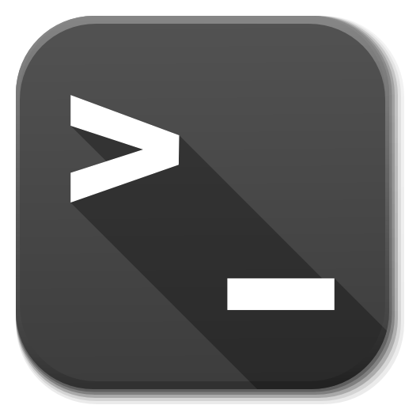
       Bash
    </td>
    <td align="center" width="96">
        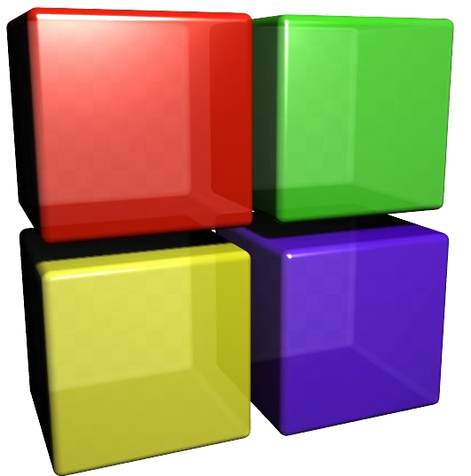 
       CodeBlocks
    </td>
      <td align="center" width="96">     
              
       Django
    </td>
    <td align="center" width="96">    
        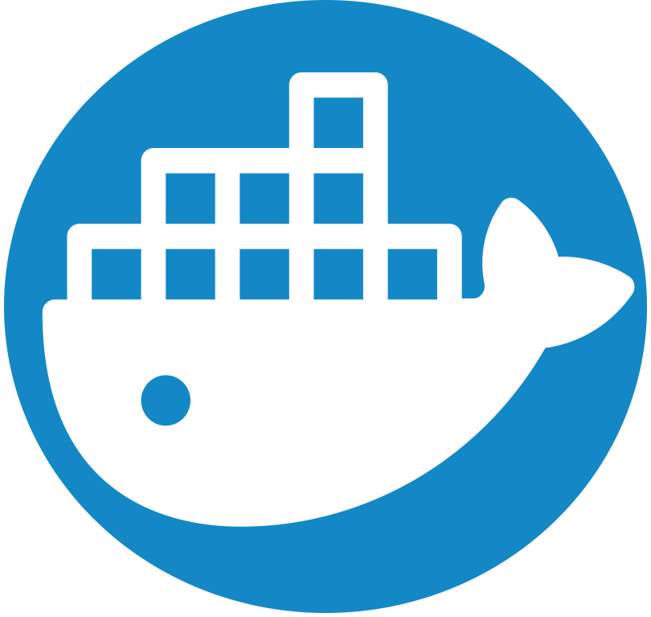     
       Docker
    </td>
    <td align="center" width="96">   
            
       Eclipse
    </td>
    <td align="center" width="96">    
             
       FileZilla
    </td>
    <td align="center" width="96">    
              
       Jupyter
    </td>
    <td align="center" width="96">   
           
       Laragon
    </td> 
  </tr>
  <tr>
    <td align="center" width="96">     
            
       MySQL
    </td>
    <td align="center" width="96">    
           
       NodeJs
    </td>
    <td align="center" width="96">     
           
       QtCreator
    </td>
    <td align="center" width="96">    
            
       R Studio
    </td>
    <td align="center" width="96">  
          
       Spyder
    </td> 
    <td align="center" width="96">   
        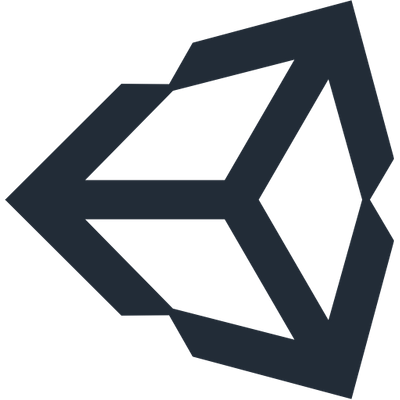    
       Unity
    </td>
    <td align="center" width="96">    
           
       Visual Studio
    </td>
    <td align="center" width="96">
          
       VS Code
    </td>
    <td align="center" width="96"> 
        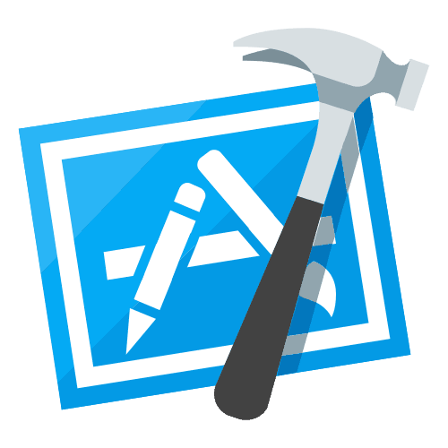 
       Xcode
    </td>
  </tr>
</table>
 
<table align="center">
  <tr>
   <td colspan="9" align="center"> 
        🏵️ Object-Oriented Languages 
    </td>
  </tr>
  <tr>
    <td align="center" width="96"> 
        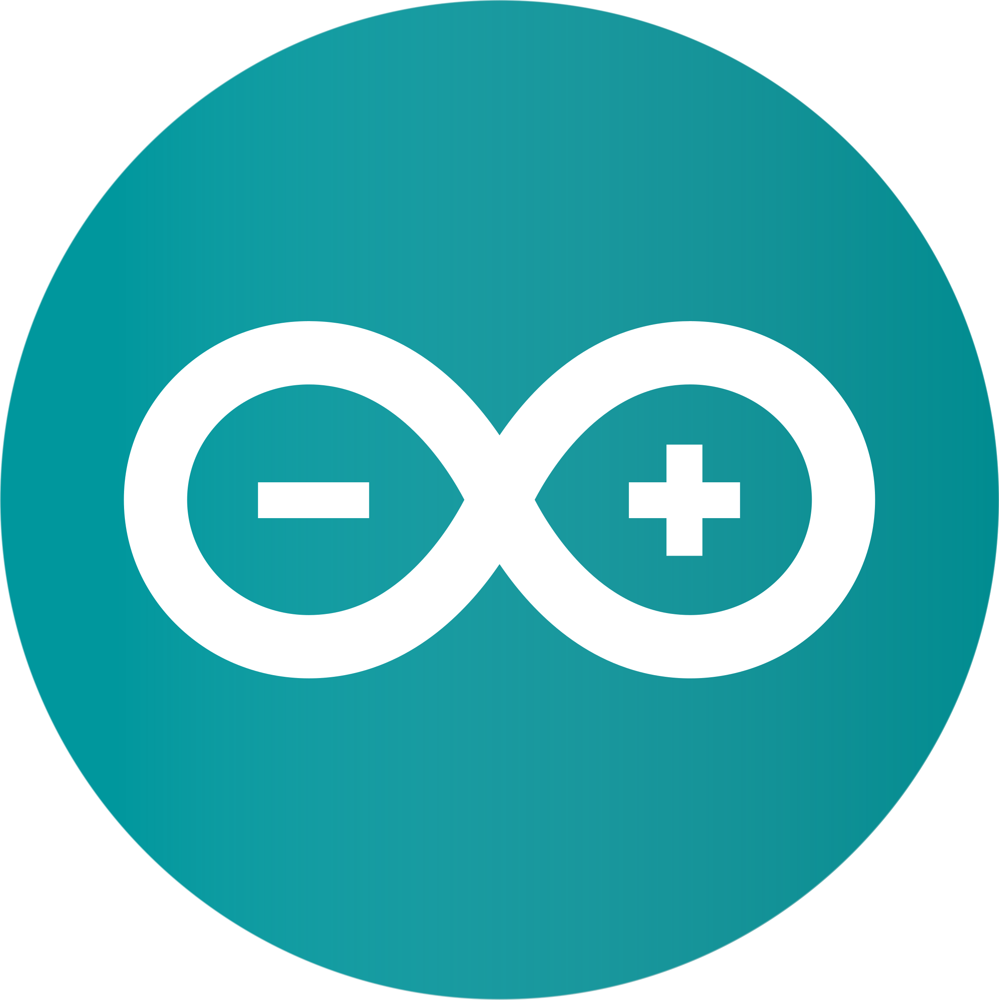
       Arduino
    </td>
    <td align="center" width="96"> 
        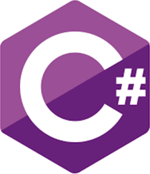
       C#
    </td>
    <td align="center" width="96">
        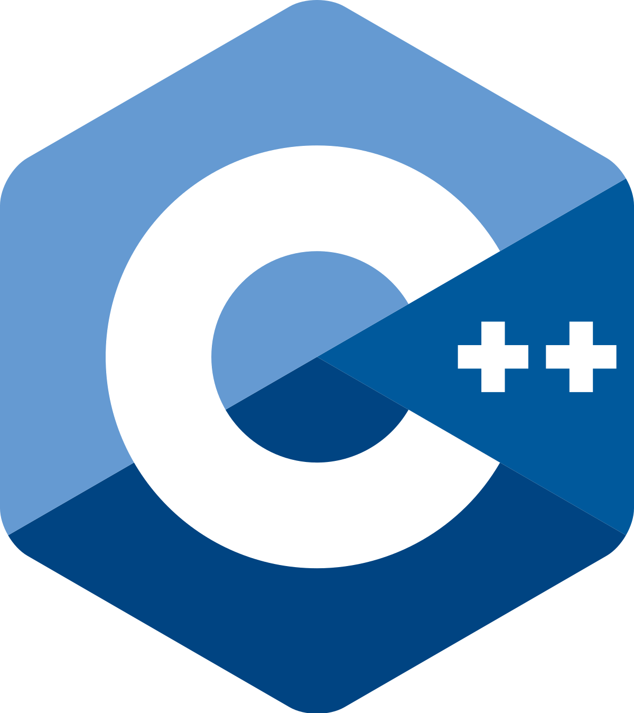
       C++
    </td>
    <td align="center" width="96">  
        
       Flutter
    </td>
    <td align="center" width="96">
        
       Java
    </td>
    <td align="center" width="96">
        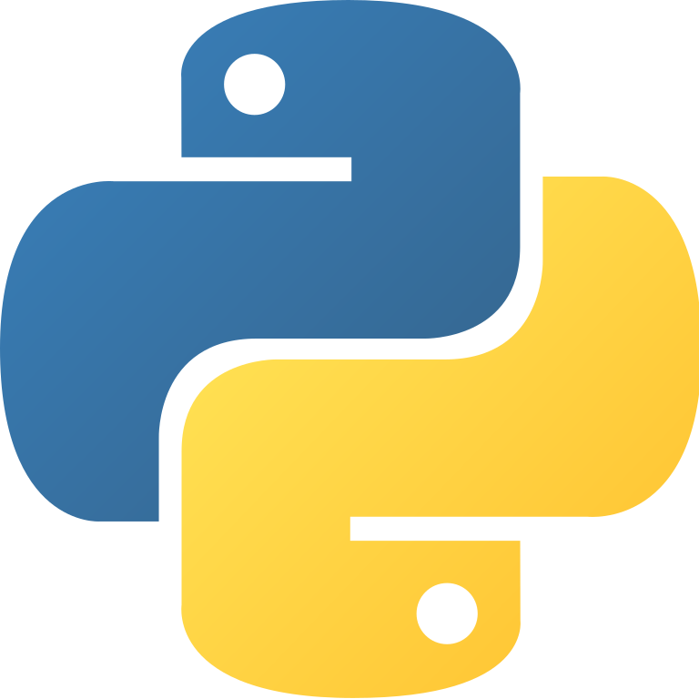
       Python
    </td>
    <td align="center" width="96">
        
       Qt
    </td>
    <td align="center" width="96">
        
       Swift
    </td>
    <td align="center" width="96">
        
       VB.net
    </td>
  </tr>
</table>
 
<table align="center">
   <tr>
   <td colspan="5" align="center">
        🌹 Web Languages
    </td>
    <td colspan="4" align="center">
        🌻 Framework
    </td>
  </tr>
  <tr>
    <td align="center" width="96">
        
       HTML
    </td>
    <td align="center" width="96">
        
       CSS
    </td>
    <td align="center" width="96">
        
       SQL
    </td>
    <td align="center" width="96">
        
       PHP
    </td> 
    <td align="center" width="96"> 
        
       JavaScript
    </td>
    <td align="center" width="96">
        
       Bootstrap
    </td>
    <td align="center" width="96">
        
       Tailwind 
    </td>
    <td align="center" width="96">
        
       React
    </td> 
    <td align="center" width="96">
        
       Vue
    </td>
  </tr>
</table>
 
<table align="center">
  <tr>
    <td colspan="9" align="center"> 
        📖 Machine Learning Libraries
    </td>
  </tr>
  <tr>
    <td align="center" width="96"> 
        
       HuggingFace
    </td>
    <td align="center" width="96"> 
        
       Keras
    </td>
    <td align="center" width="96">
        
       Numpy
    </td>
    <td align="center" width="96">
        
       Pandas
    </td>
    <td align="center" width="96">  
        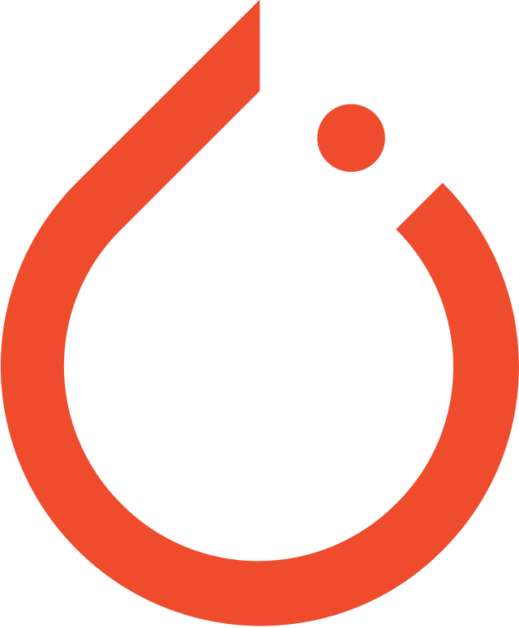
       PyTorch
    </td>
    <td align="center" width="96">
        
       Seaborn
    </td>
    <td align="center" width="96">
        
       Sklearn
    </td>
    <td align="center" width="96">
        
       Selenium
    </td>
    <td align="center" width="96">
        
       TensorFlow
    </td>
  </tr>
</table>
 
<table align="center">
  <tr>
  <td colspan="5" align="center"> 
        🗃️ Big Data
    </td>
   <td colspan="4" align="center">
        🌱 OS
    </td>
  </tr>
  <tr>
    <td align="center" width="96"> 
        
       Elastic
    </td>
    <td align="center" width="96">  
        
       MongoDB
    </td>
    <td align="center" width="96"> 
        
       Neo4j
    </td>
    <td align="center" width="96">
        
       Tableau
    </td>
    <td align="center" width="96">
        
       PowerBI
    </td>
    <td align="center" width="96">
        
       Android
    </td>
    <td align="center" width="96">
        
       Debian
    </td>
    <td align="center" width="96">
        
       Ubuntu
    </td>
    <td align="center" width="96">
        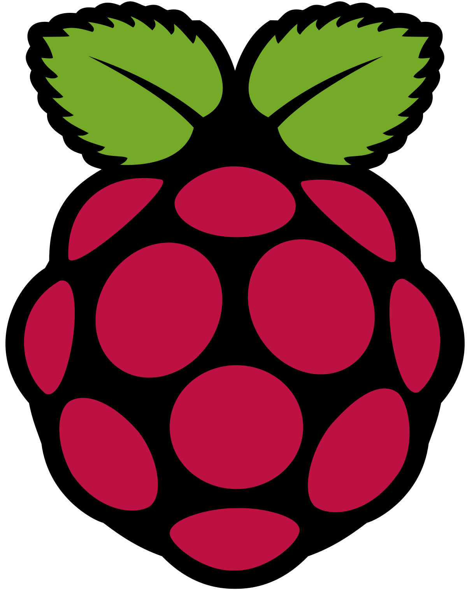
       Raspberry
    </td> 
  </tr>
</table>
 
<table align="center">
  <tr>
   <td colspan="3" align="center"> 
        🏴 Competition
   </td>
  </tr>
  <tr>
   <td align="center" width="288" height="64">
        🌺 CSS
   </td>
   <td align="center" width="288" height="64"> 
        🤖 Artificial Intelligence
   </td>
   <td align="center" width="288" height="64">
        🔑 CyberSecurity
   </td>
  </tr>
  <tr>
    <td align="center" width="288" height="64">
      
      
⭐ 1577 points
 
    </td>
    <td align="center" width="288" height="64">
      
      
⭐ Unranked
 
    </td>
    <td align="center" width="288" height="64">
      
      
⭐ 50 points
 
    </td>
  </tr>
</table>

---

 
  Visitor Counter
   
   
  

